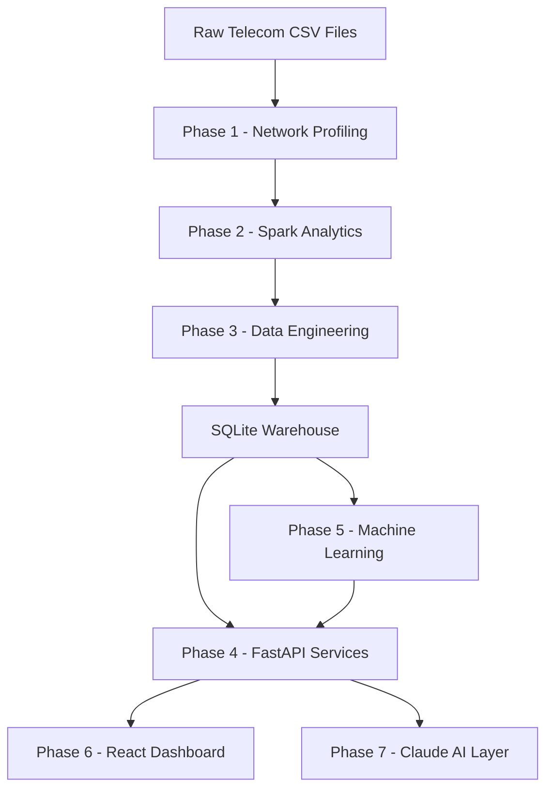
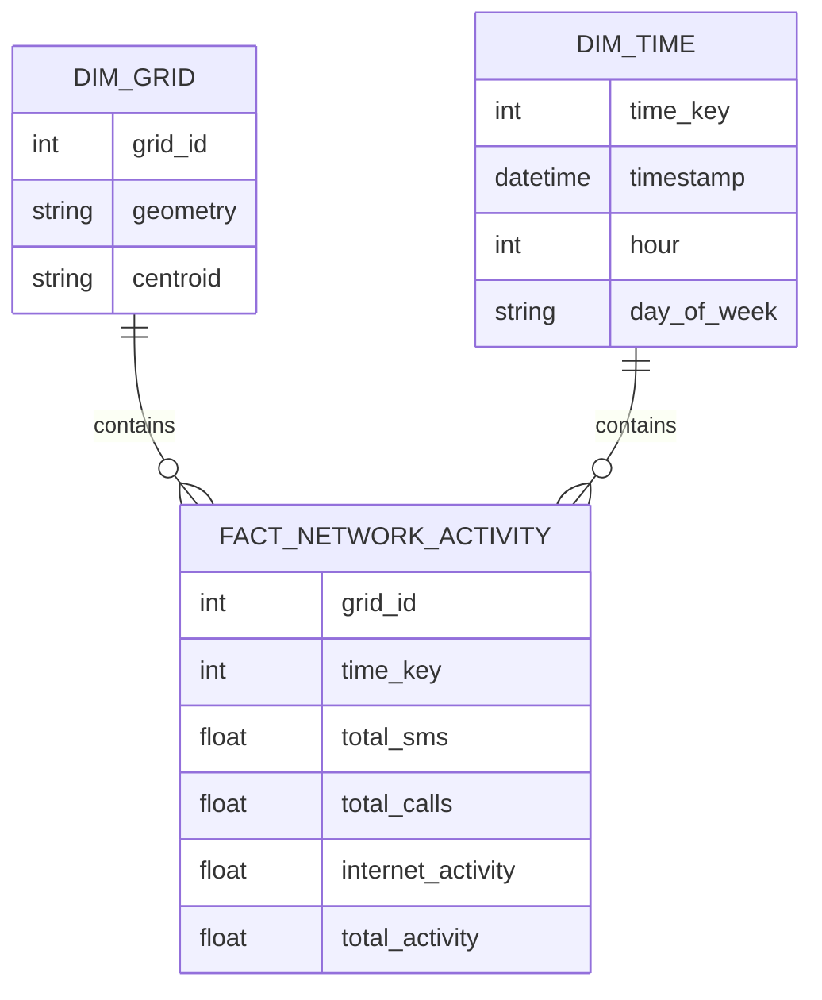

# 🌐 Network Operations Predictive Intelligence

<div align="center">

# 📡 End-to-End Telecom Analytics, Machine Learning, Dashboard & AI Operations Platform

### Python • PySpark • Airflow • SQLite • FastAPI • React • Claude AI

Transforming telecom activity data into operational intelligence through analytics, machine learning, geospatial visualization, and AI-assisted investigation.

</div>

---

# 🚀 Project Overview

Network Operations Predictive Intelligence is an enterprise-style telecom analytics platform built using the **Milan Telecom Grid Activity Dataset**.

The system transforms raw telecom activity records into:

✅ Automated Data Pipelines

✅ Spatial Network Analytics

✅ Data Warehouse & FastAPI Services

✅ Network Activity Prediction

✅ Interactive Network Operations Dashboard

✅ Claude AI-Assisted Investigation

The project demonstrates a complete operational workflow from data ingestion through AI-powered analysis while preserving strict evidence-based reasoning standards.

---

# 🎯 Business Objectives

Telecom operators require visibility into network activity trends and emerging operational risks.

This platform enables:

- Detection of unusual activity patterns
- Investigation of high-activity grid cells
- Operational hotspot monitoring
- Predictive activity-risk assessment
- Pipeline-health monitoring
- AI-assisted analysis using grounded evidence

**Important Operational Rule**

> Activity data does NOT represent network capacity, congestion, throughput, packet loss, latency, or outage evidence.

The platform deliberately treats alerts, anomalies, and risk scores as investigation signals rather than proof of network faults.

---

# 📊 Dataset Overview

## Milan Telecom Grid Activity Dataset

| Metric | Value |
|----------|----------|
| Geographic Coverage | Milan |
| Grid Cells | 10,000 |
| Time Granularity | Hourly |
| Warehouse Fact Rows | 1,679,994 |
| Time Dimension Rows | 168 |
| Activity Metrics | SMS, Calls, Internet |
| Top Activity Grid | 5161 |
| ML Test Rows | 239,976 |

---

# 🏗️ System Architecture



---

# 🔄 End-to-End Data Flow

```text
Raw Telecom Activity Files
            │
            ▼
Data Profiling
            │
            ▼
PySpark Processing
            │
            ▼
Spatial Enrichment
            │
            ▼
Analytics Parquet
            │
            ▼
SQLite Data Warehouse
            │
            ▼
FastAPI Service Layer
            │
     ┌──────┴──────┐
     ▼             ▼
React UI     Machine Learning
                     │
                     ▼
            Predictive Risk Scores
                     │
                     ▼
             Claude AI Assistant
```

---

# 📂 Repository Structure

```text
network-ops-project/

├── ingestion/
│   └── ingestion.py
│
├── spark/
│   └── telecom_pipeline.py
│
├── warehouse/
│   ├── load.py
│   └── network_ops.db
│
├── airflow/
│   └── dags/
│
├── app/
│   ├── routes/
│   ├── services/
│   ├── models/
│   └── main.py
│
├── ml/
│   ├── feature_engineering.py
│   ├── train_model.py
│   ├── anomaly_detection.py
│   ├── batch_scoring.py
│   └── models/
│
├── frontend/
│
├── ai/
│   ├── claude_assistant.py
│   ├── context_builder.py
│   └── investigation_service.py
│
├── docs/
│
├── tests/
│
├── requirements.txt
│
└── README.md
```

---

# 📈 Phase 1 — Network Profiling & Problem Framing

The first phase focuses on understanding the raw dataset and establishing operational boundaries before any transformation occurs.

---

## NP1 — Dataset Profiling

### Objectives

- Validate schema
- Validate hourly cadence
- Check duplicates
- Check missing values
- Understand source limitations

### Findings

✅ 24 hourly timestamps verified

✅ Source schema documented

✅ Data quality checks completed

✅ Row-level profiling completed

---

## NP2 — Canonical Schema

The source dataset was standardized into a reusable schema.

### Example Mapping

```python
{
    "CellID": "grid_id",
    "smsin": "sms_in",
    "smsout": "sms_out",
    "callin": "call_in",
    "callout": "call_out",
    "internet": "internet_activity"
}
```

---

## NP3 — Operational Limitations

### Supported

✅ Activity monitoring

✅ Trend analysis

✅ Predictive activity risk

✅ Anomaly detection

### Unsupported

❌ Congestion detection

❌ Capacity utilization

❌ Throughput estimation

❌ Latency analysis

❌ Outage confirmation

---

# ⚡ Phase 2 — Spark Processing & Spatial Analytics

PySpark transforms raw activity data into scalable analytics-ready datasets.

---

## Spark Pipeline

```text
Raw CSV
   │
   ▼
Cleaning
   │
   ▼
Aggregation
   │
   ▼
Geospatial Enrichment
   │
   ▼
Quality Checks
   │
   ▼
Parquet Publication
```

---

## Deliverables

### SP1

Spark Environment Setup

### SP2

Canonical Cleaning

### SP3

Hourly Grid Aggregation

### SP4

GeoJSON Spatial Join

### SP5

Analytics Quality Validation

### SP6

Parquet Publication

### SP7

Reusable Spark Job

---

## Key Output

### Analytics Dataset

```text
Rows: 1,679,994

Columns:
- grid_id
- timestamp
- sms_in
- sms_out
- call_in
- call_out
- internet_activity
- total_sms
- total_calls
- total_activity
```

---

# ⚙️ Phase 3 — Data Engineering & Airflow

The Data Engineering layer automates the journey from landing files to warehouse publication.

---

## Airflow Pipeline


---

## DE Components

### DE1

Architecture Design

### DE2

Landing-to-Raw Ingestion

### DE3

Spark Orchestration

### DE4

Batch vs Streaming Analysis

### DE5

Data Zone Strategy

### DE6

Warehouse Modelling

### DE7

Full Pipeline Orchestration

### DE8

Reliability Validation

---

## Warehouse Statistics

| Component | Rows |
|------------|------------|
| dim_grid | 10,000 |
| dim_time | 168 |
| fact_network_activity | 1,679,994 |

---

# 🗄️ Warehouse Design



---

# 🌐 Phase 4 — FastAPI Operational Services

The platform exposes warehouse analytics through production-style REST APIs.

---

# API Endpoints

## Network APIs

```http
GET /network/summary
```

```http
GET /network/grid/{grid_id}
```

```http
GET /network/hotspots
```

---

## Feature APIs

```http
GET /network/grid/{grid_id}/features
```

---

## Prediction APIs

```http
POST /network/predict
```

---

## Operational APIs

```http
GET /pipeline/status
```

---

# Example Response

```json
{
  "grid_id": 4821,
  "risk_score": 0.0209,
  "risk_level": "LOW",
  "model_version": "ml3-logreg-v1"
}
```

---

# 🤖 Phase 5 — Machine Learning

Machine learning predicts future high-activity risk using only historical observations.

---

## Prediction Objective

```text
Predict activity status at T+1
Using features available at T
```

---

## Engineered Features

| Feature |
|----------|
| avg_activity |
| activity_growth |
| active_hours |
| peak_ratio |
| variability |
| internet_share |

---

## Models

### Logistic Regression

Selected for:

✅ Explainability

✅ Stable coefficients

✅ Operational simplicity

✅ Easy deployment

---

## Performance

| Metric | Value |
|----------|----------|
| Accuracy | 95.29% |
| Precision | 82.15% |
| Recall | 71.94% |
| Test Rows | 239,976 |

---

## Top Coefficients

| Feature | Coefficient |
|----------|----------|
| avg_activity | +3.2801 |
| peak_ratio | +0.3725 |
| variability | -0.2062 |
| activity_growth | -0.1187 |

---

## Example Risk Output

```json
{
  "risk_score": 0.0209,
  "risk_level": "LOW",
  "model_version": "ml3-logreg-v1"
}
```

---

# 📍 Phase 6 — React NOC Dashboard

The React dashboard provides an operator-facing interface over the API layer.

---

## Dashboard Pages

### 🏠 Network Overview

Executive KPI summary

### 🔍 Grid Explorer

Investigate grid-level activity

### ⚠️ Hotspots & Alerts

Operational attention dashboard

### 🗺️ Milan Network Map

GeoJSON-based interactive visualization

### 🤖 Predictive Risk

Evaluate feature-driven activity risk

---

# 🧠 Phase 7 — Claude AI Integration

Anthropic Claude is integrated as a reasoning layer over curated operational evidence.

---

## C1 — Insight Generation

Creates structured operational reports.

### Output Format

```text
SEVERITY

EVIDENCE

INTERPRETATION

NEXT CHECKS
```

---

## C2 — Tool-Using Assistant

Claude can call:

- Network Summary
- Grid Activity
- Features
- Hotspots
- Pipeline Status
- Grid Location
- Anomaly Score

---

## C3 — Long Context Investigation

Combines:

✅ Current Activity

✅ Historical Summary

✅ ML Predictions

✅ Pipeline Status

✅ Location Information

✅ Evidence Provenance

---

## Context Compression Results

| Type | Characters |
|---------|---------|
| Raw Context | 33,552 |
| Curated Context | 2,517 |
| Reduction | 31,035 |

Compression Ratio:

```text
92.5% Reduction
```

---

# 📊 Key Project Findings

---

## Top Grid

```text
Grid 5161
```

Total Activity:

```text
1,789,842.579
```

---

## ML Performance

```text
Accuracy : 95.29%

Precision : 82.15%

Recall : 71.94%
```

---

## Grid 4821 Investigation Example

### Timestamp

```text
2013-11-07 23:00:00
```

### Risk Score

```text
0.0209
```

### Risk Level

```text
LOW
```

### Anomaly

```text
FALSE
```

---

# 🧪 Testing & Validation

The platform uses validation across every layer.

### Coverage

✅ Data Quality Tests

✅ Spark Validation

✅ Warehouse Reconciliation

✅ API Tests

✅ ML Tests

✅ Claude Grounding Tests

✅ Integration Tests

---

## Final Test Suite Result

```text
124 PASSED
0 FAILED
```

---

# 🔒 Security Principles

### Authentication

Environment Variables

```env
ANTHROPIC_API_KEY=
```

### Rules

✅ No secrets in source code

✅ No raw telecom rows to Claude

✅ Explicit uncertainty reporting

✅ Structured evidence-only responses

# 🛠️ Installation

## Clone Repository

```bash
git clone https://github.com/yourusername/network-ops-project.git
```

---

## Create Virtual Environment

```bash
python -m venv venv
```

---

## Activate Environment

### Windows

```bash
venv\Scripts\activate
```

### Linux / Mac

```bash
source venv/bin/activate
```

---

## Install Dependencies

```bash
pip install -r requirements.txt
```

---

## Run FastAPI

```bash
uvicorn app.main:app --reload
```

---

## Run Frontend

```bash
cd frontend

npm install

npm run dev
```

---

## Run Tests

```bash
pytest tests -v
```

---

# 🎯 Future Enhancements

- Kafka Streaming Pipeline
- Real-Time Risk Scoring
- SHAP Explainability
- Drift Monitoring
- Multi-City Expansion
- Kubernetes Deployment
- Advanced Claude Capabilities
- Streaming Feature Store

---

# 👨‍💻 Author

**Mohammed Marzook Lathief N M**

Network Operations Predictive Intelligence

---

# ⭐ Final Outcome

```text
Telecom Activity
        ↓
PySpark Analytics
        ↓
Warehouse
        ↓
FastAPI
        ↓
Machine Learning
        ↓
React Dashboard
        ↓
Claude AI
```

### A complete end-to-end Telecom Operations Intelligence Platform combining Data Engineering, Analytics, Machine Learning, Geospatial Visualization, FastAPI Services, React Dashboards, and AI-Assisted Investigation.
